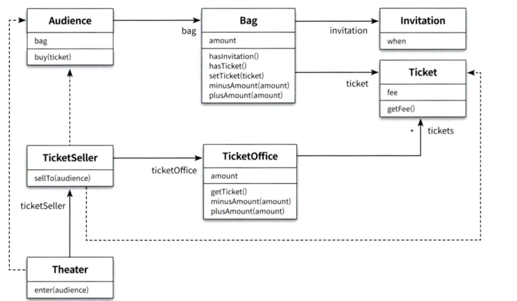
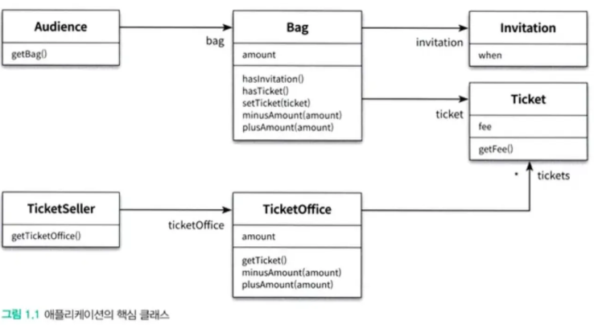
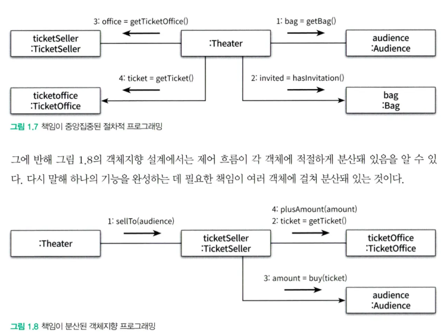

앞선 예시들은 Audience와 TicketSeller의 책임이 다른 객체에 의해 제어된다는 것이 예상 범주내에서 벗어나기 때문에 문제가 될 수 있었음

Audience와 TicketSeller가 Theater객체에 강하게 결합되기 때문

Audience와 TicketSeller가 변경되면 Theater도 변경해야 하는 잠재적 문제가 발생될 수 있음

해결법

Audience와 TicketSeller에 대한 정보은닉

자율적인 객체로 두면 됨

Theater#enter 메서드 리팩토링

기존 Theater에서 TicketOffice에 접근하는 로직을 제거하고 TicketSeller의 책임으로 이동 (캡슐화)

변경된 코드에서는 Theater는 TicketOffice에 대한 의존성을 갖지 않게 됨

Theater에 진입하기 위한 방법은 ticketSeller의 sellTo 메시지를 통한 것만 알게됨

Theater는 TicketSeller 인터페이스만 의존, TicketSeller가 내부에 TicketOffice를 포함하는 것은 구현체에 해당

객체를 인터페이스와 구현체로 나누어 다른 객체와 소통하는 매개체인 인터페이스만 공개하는 것은 객체 지향 기본 설계 원칙에 해당

TicketSeller에서 Audience에 대한 의존마저 분리하게 되면 Audience의 buy에 대한 구현이 변경되더라도 TicketSeller에 영향을 미치지 않게됨

최종 설계

기존 설계

설계를 변경하게 되면 Audience가 bag을 소지하는게 아니라 다른걸 소지하더라도 변경이 전달되지 않게 됨

기존 코드에서는 Theater가 Audience와 TicketOffice에 대한 모든 구현을 알고있어야 했고 강하게 결합되어 있었지만 변경하게 되면 Theater가 Audience와 TicketOffice의 내부에 직접 접근하지 않게 됨

객체의 자율성을 높이게 된다

객체가 가져야할 책임을 높이고 연관성 없는 작업을 다른 객체에 위임함으로서 응집도를 높일 수 있게 됨

객체간의 결합도는 낮추고 단일 객체의 응집도를 높이는게 중요해 보임!

Q. 객체간의 결합도는 낮출 수 있겠지만 객체 안에서의 메서드끼리의 결합도는 어떻게 낮출 수 있을까?

기존 코드에서는 Theater가 모든 객체들에 의존하기 때문에 이걸 절차적 프로그래밍이라고 한다네

절차적 프로그래밍은 변경하기 어려운 코드를 양상하기도 함

변경하기 쉬운 설계는 한번에 하나의 클래스만 변경할 수 있는 설계이다.

캡슐화를 통해 의존성을 적절히 관리함으로서 객체간의 결합도를 낮추는게 훌륭한 객체 지향 설계다~

객체는 다른 객체와 협력하기 위한 적절한 책임을 가져야 한다

이를 위해 적절히 책임을 이동시킬 필요도 있고, 정확히는 객체에 어떤 책임을 할당할지를 잘 생각하면서 설계하는게 좋다