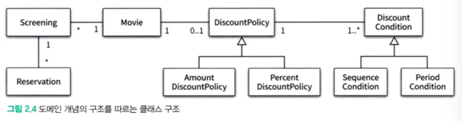

### **협력, 객체, 클래스**

클래스를 결정한 후에 클래스에 어떤 속성과 메서드가 필요한지 결정하는 행위는 잘못된거다.

객체지향은 말 그대로 객체를 지향하는 것.

어떤 클래스가 필요한지를 고민하기 전에 어떤 객체가 필요한지를 고민해야 한다.

객체가 어떤 상태와 행동을 가지는지를 먼저 결정해야 한다.

객체는 독립적인 존재로 볼게 아니라 협력하는 구성원 중 하나로 봐야한다.

객체의 윤곽이 잡히면 공통된 특성과 상태를 가진 객체들을 타입으로 분류하고 기반해서 클래스를 구현해야 한다.

### 도메인의 구조를 따르는 프로그램 구조

도메인은 문제 해결을 위한 프로그램 사용 분야

객체지향의 추상화 기법을 통해 도메인을 구성하는 개념들이 프로그램 상의 객체와 클래스로 연결될 수 있다.

영화는 여러번 상영되지만 상영할때는 영화 하나만 상영하게 된다.

일반적으로 클래스 이름은 대응되는 도메인 개념 이름으로 짓는다

### 클래스 구현하기

클래스는 내부, 외부로 구분해 어떤 부분은 외부로 공개하고 어떤 부분을 캡슐화할지 결정하는게 중요한 요소

내부 외부로 구분하는 건 객체의 자율성을 보장하기 때문 → 구현의 자유를 준다

Screening 클래스에서는 public 메서드를 통해 내부 상태를 변경할 수 있게 함

*자율적인 객체*

객체는 상태와 행동을 가짐

객체는 스스로 판단하고 행동하는 자율적인 존재

과거에는 데이터와 기능이라는 독립적 존재를 서로 엮어서 프로그램을 구성했지만, 객체지향에서는 객체 단위 안에 데이터와 기능을 한 덩어리로 묶어서 표현한다. → 캡슐화와 관련

객체지향에서는 외부의 접근을 통제하고 객체를 자율적인 존재로 만드는 접근 제한자도 중요한 요소중 하나

캡슐화와 접근 제어는 객체를 두 부분으로 나누게 됨

외부에서 접근 가능한 부분은 인터페이스, 내부에서만 접근 가능한 부분은 구현이라고 부름

공개 가능한 부분만 public, 감춰야 하는 부분은 private으로 지정해야함

즉, 인터페이스는 public 메서드만 존재하게 된다.

*프로그래머의 자유*

클라이언트 프로그래머랑 클래스 작성자로 구분하는 것 같은데 내 생각에는 클라 프로그래머가 그냥 서비스 개발자, 클래스 작성자가 SDK 개발이나 core단만 만지는 개발자겠지?

클래스 작성자는 클라개발자의 잘못된 사용으로 내부 구현에 영향가지 않도록 구현은닉을 잘 해야한다~

클래스 작성자는 public 영역을 변경하지 않는 선에서 코드를 자유롭게 수정할수도 있다.

클라이언트 프로그래머는 public 영역만 알아도 되기 때문에 지식양을 줄일 수 있음

객체지향 설계는 변경을 관리하기 위해서라도 중요하다

변경을 관리하는 기법중에서 대표적인게 접근제한자다~

### 협력

객체는 다른 객체의 인터페이스에 특정 행동을 수행하도록 요청 (메시지 전송)

요청받은 (메시지 수신) 객체는 자율적 방법에따라 요청을 처리 후 응답

메시지를 수신한 객체가 자율적으로 메시지를 처리할 방법을 결정, 메서드를 통해 처리한다

**Q. 수신하기 위해 public interface 메서드를 열어두고 그거에 대한 구현이 있을 텐데, 여기서 말하는 메서드가 public interface 메서드의 구현 메서드인지 아니면 구현 메서드 안에 또 다른 메서드인지? 후자일 것 같긴함**