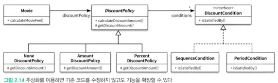

영화 요금을 계산하기 위해서는 DiscountPolicy를 따라야 하고, DiscountCondition을 만족하냐 안하냐에 따라 할인 금액이 결정된다.

DiscountPolicy, DiscountCondition 모두 추상화된 개념인데 이렇게 일반적인 개념들을 통해 표현될 수 있음

  
추상화를 통해 세부 구현은 무시하고 상위 개념으로도 도메인의 중요 부분들을 설명할 수 있다

기존 구조를 수정하지 않고도 새로운 기능을 쉽게 추가하고 확장할 수 있다.

두가지 특징 다 유연한 설계에 대한 내용

  
책에 나온 NonDiscountPolicy를 추가하는 것만으로도 기존 코드 수정없이 기능 확장이 가능해짐

  
더 추상화를 진행한다면 DiscountPolicy에 개념적으로 NoneDiscountPolicy의 내용이 들어가있기 떄문에 추상화 뎁스를 한단계 추가해서 분리시킬 수 있음

  
상속은 코드 재사용을 위해 사용되지만 캡슐화를 위반할 수도 있고 설계를 유연하게 하지 못할수도 있음

부모클래스 내부 구조를 잘 알고 있어야 하고, 부모 클래스 구현이 자식 클래스에 그대로 노출되기 때문에 변경의 여파가 그대로 전달될수도 있게 됨

과도한 상속은 오히려 변경에 어려움을 줄수도 있게 됨

또, 부모 - 자식 클래스 관계를 컴파일 시점에 결정하기 때문에 런타임에 객체의 종류를 변경하는데 제한이 생김

그래서 상속보다는 합성(composition)을 많이 쓴다~

합성은 다른 객체의 인스턴스를 자신 객체의 인스턴스 변수로 포함해서 재사용하는 것

또한, 인터페이스에 정의된 메시지를 통해서만 다른 객체의 코드를 재사용하는 방법