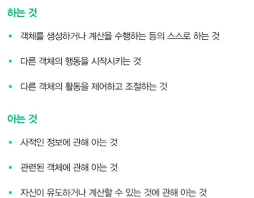

책임은 객체가 협력에 참여하기 위해 수행하는 행동을 의미

객체에 정의되는 응집도 있는 행위들의 집합이다.

여기서 객체가 유지해야하는 정보와 수행할 수 있는 행동들에 대해 서술한 문장으로 이해할 수 있음

아는 것 : 책임을 수행하기 위한 인스턴스 변수?

하는 것 : 책임을 수행하기 위한 메서드?

책임은 아는것, 하는것과 밀접하게 연관되어있음

객체가 자신이 할 수 없는 행위를 위임하거나 도와줄 객체에 대해 알고있을 책임도 있음

Screening이 reserve라는 메시지를 수신하고 movie를 인스턴스 변수로 갖고 있는 건 영화를 예매할 책임을 수행해야 하기 때문

Movie가 calculateMovieFee 메시지를 수신하고, fee와 DiscountPolicy를 인스턴스 변수로 갖는건 요금을 계산해야하는 책임을 수행해야 하기 때문

즉, 협력 안에서 객체에 할당된 책임이 외부의 인터페이스와 내부 속성을 결정한다

객체지향 설계에서 가장 중요한건 책임이다

객체에 얼마나 적절한 책임을 부여하는지에 따라 전체적인 설계의 품질을 좌우함

책임을 할당하기 위해서는 협력을 어떻게 할지를 정해야 함

영화 예매 시스템에서는 예매하라라는 메세지를 시발점으로 객체들이 협력을 시작함

예매하라라는 메시지를 처리해야할 객체를 선택해야하는데~ 이거에 대한 책임을 질 객체를 어떤걸 선택해야할까

영화 예매와 관련된 정보를 가장 많이 알고있는 객체 (책에서는 정보 전문가?로 표현)에게 할당해야 함 → Screening 객체

예매를 위해 가격을 계산해야하는데 가격 계산에 대한 책임은 Screening의 책임이 아님

즉 다른 객체에 위임하고 계산하기 위한 메세지를 전달해야 하는데 이 객체는 Movie

**Q. 근데 책에서 이야기하는 정보전문가라는 말이 정확히 무슨말인지 이해를 못한듯..?ㅋㅋ**

중요한 점은 객체가 메세지를 선택하는게 아니라 메세지가 객체를 선택하는 것.

이렇게 하려면 최소한의 인터페이스를 가져야 함

무엇을 하는지에 대한 추상적인 인터페이스를 가질 수 있게됨, 어떻게는 어차피 캡슐화됨

객체의 캡슐화를 위반하지 않도록 객체의 행위를 고려하기 위해서는 객체가 참여하는 협력 상의 문맥을 판단하면서 객체를 생각해야 한다. 구현은 일단 후순위

협력 관계 안에서 다른객체로 부터 뭘 받아야할지, 뭘 전달해야할지를 판단하는게 훌륭한 책임을 찾는 방법

이렇게 해야 객체의 응집도를 높이고 결합도를 낮출 수 있음

상태는 단순히 객체가 행동을 정상적으로 수행하기 위한 재료일 뿐

행동이 먼저 정의가 되어야 그에 필요한 상태들을 결정할 수 있다