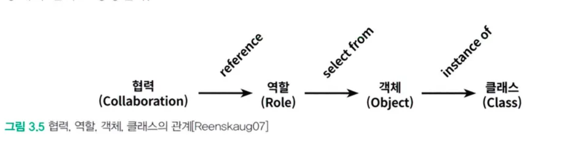

역할은 협력안에서 객체가 수행하는 책임의 집합

역할이 중요한 이유는 역할을 통해 유연하고 재사용 가능한 협력을 얻을 수 있기 때문

역할이 정의되지 않은 상태에서 책임을 할당한다면 아래같은 상황이 만들어질 수 있음

가격 계산 메세지에 응답하기 위해서 요금 계산에 대한 할인 정책들이 있을 텐데 각각을 별개의 협력으로 본다면 중복으로 작성되는 코드가 많아질것임

결국 이렇게 되어야 할인 정책 선택 책임에 대한 역할이 생기게 됨

즉, 역할이 두 정책의 구체적인 객체를 포괄하는 추상화로 볼 수 있음

협력의 관점에서 추상화(인터페이스, 추상클래스)는 구체 클래스들이 따라야하는 책임의 집합을 서술한 것

인터페이스, 추상클래스 선택 기준?

1. 추상클래스 : 구체 클래스들이 공유하는 상태와 행동의 기본 구현이 존재하는 경우
2. 인터페이스 : 공통의 구현은 없지만 책임의 집합만 서술하는 경우

객체 vs 역할?

협력에 참여하는 대상이 여러 종류의 객체에 의해 수행될 필요가 있다?  → 역할

협력에 참여하는 대상이 하나의 객체일 경우 → 객체

설계 초반에는 적절한 책임과 협력의 큰 그림을 탐색하는게 중요한 목표여야 함

역할과 객체를 명확하게 구분하는건 초반에는 그렇게 중요하지 않다네

단순하게 객체로 시작하고 책임과 협력을 계속 정제하면서 적절하게 역할을 분리해내는게 좋음

역할은 공통의 책임을 바탕으로 객체의 종류를 숨기기 때문에 역할도 추상화로 볼 수 있음

구체 객체로 대체 가능한 DiscountPolicy와 DiscountCondition이 역할에 해당함