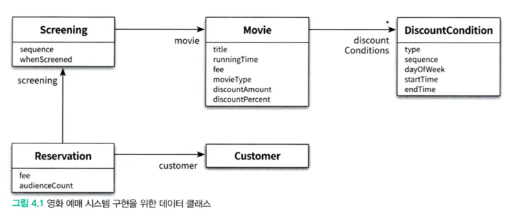

## 0. 개론

객체지향 설계의 핵심은 역할, 책임, 협력이다.

- 협력은 메세지를 주고받는 객체들 간의 상호작용
- 책임은 객체가 다른 객체와 협력하기 위해 수행하는 행동
- 역할은 추상화하여 대체할 수 있는 책임의 집합

협력 > 역할 > 책임으로 볼 수 있다.

책임 주도 설계에서는 책임이 가장 중요시 되기 때문에 수행할 책임이 적절하게 할당되지 못한다면 원활한 협력을 기대할 수 없다. 즉, 책임이 객체지향 애플리케이션 전체의 품질을 좌우한다.

객체지향 설계는 객체에게 올바른 책임을 할당하면서도 결합도는 낮게, 응집도는 높은 구조를 가지도록 하는 것이다.
설계하는 과정에서 변경은 반드시 생기기 때문에 합리적인 비용 안에서 변경이 가능하도록 하는 트레이드오프는 있게 된다. 적절한 비용 안에서 변경 가능하도록 설계하는게 중요.

합리적인 결합도와 응집도를 결정하는 방법은 객체의 상태가 아닌 행동 중심으로 보는 것이다.
상태를 중심으로 보게되면 어쩔수없이 인터페이스에 구현을 노출시키는 경우가 생기기 때문

## 1. 데이터 중심의 영화 예매 시스템

시스템을 객체로 분할시키는 두가지 방법이 있다.

1. 객체의 상태(== 데이터)를 기준으로
    - 자신의 데이터를 조작하는데 필요한 operation을 정의
    - 객체를 독립된 데이터 덩어리로 본다
    - 구현에 관한 세부사항이 인터페이스에 녹아들어가기 때문에 캡슐화가 깨짐
      → 상태 변경이 인터페이스의 변경이 될 수 있음 (변경에 취약)
2. 객체의 책임을 기준으로
    - 다른 객체가 요청할 수 있는 operation을 위해 필요한 상태를 정의
    - 객체를 협력하는 공동체의 일원으로 본다.
    - 책임을 드러내는 인터페이스, 책임을 수행하는데 필요한 상태 캡슐화는 별도
      → 상태가 변경되더라도 외부의 변경으로 전달되지 않음
      → 안정적인 설계를 할 수 있음

### 데이터 기반 설계를 한다면?

```kotlin
class Movie {
    private lateinit var title: String
    private lateinit var runningTime: Duration
    private lateinit var fee: Money
    private lateinit var discountConditions: List<DiscountCondition?>
    private lateinit var movieType: MovieType
    private lateinit var discountAmount: Money
    private var discountPercent by Delegates.notNull<Double>()
}

enum class MovieType {
    AMOUNT_DISCOUNT,
    PERCENT_DISCOUNT,
    NONE_DISCOUNT,
    ;
}

enum class DiscountConditionType {
    SEQUENCE,
    PERIOD,
    ;
}
```

Movie에 필요한 데이터를 먼저 결정하는 것으로 시작

영화에 사용된 할인 정책의 종류를 결정하기 위해 enum도 추가

할인 조건에 대한 종류도 결정하기 위해 enum 추가
<br></br>
데이터를 정의했으면 객체지향을 위해 내부 데이터가 외부 객체에 영향을 주는 것을 막기위해 getter/setter등을 정의해야 함

```kotlin
fun getMovieType(): MovieType {
    return movieType
}

fun setMovieType(movieType: MovieType) {
    this.movieType = movieType
}
..

===>
data class Movie(
    val title: String,
    val runningTime: Duration,
    val fee: Money,
    val discountCondition: List<DiscountCondition>,
    val movieType: MovieType,
    val discountAmount: Money,
    val discountPercent: Double,
)
```

이런식으로 DiscountCondition, Screening, Reservation 클래스도 데이터 중심으로 구현한다.



ReservationAgency를 정의하면 아래처럼 됨

```kotlin
class ReservationAgency {
    fun reserve(screening: Screening, customer: Customer, audienceCount: Int): Reservation {
        val movie = screening.movie
        var discountable: Boolean = false

        movie.discountCondition.forEach { condition ->
            discountable = if (condition.type == DiscountConditionType.PERIOD) {
                (screening.whenScreened.dayOfWeek.equals(condition.dayOfWeek)
                        && condition.startTime <= screening.whenScreened.toLocalTime()
                        && condition.endTime >= screening.whenScreened.toLocalTime())
            } else {
                condition.sequence == screening.sequence
            }
            if (discountable) return@forEach
        }

        val fee = if (discountable) {
            val discountAmount = when (movie.movieType) {
                MovieType.AMOUNT_DISCOUNT -> {
                    movie.discountAmount
                }

                MovieType.PERCENT_DISCOUNT -> {
                    movie.fee.times(movie.discountPercent)
                }

                MovieType.NONE_DISCOUNT -> {
                    Money.ZERO
                }
            }
            movie.fee.minus(discountAmount)
        } else {
            movie.fee
        }

        return Reservation(customer, screening, fee, audienceCount)
    }
}
```

## 2. 트레이드오프

캡슐화, 응집도, 결합도로 데이터 중심 설계와 책임 중심 설계를 비교할 수 있다.

### 캡슐화

외부에서 알 필요가 없는 부분을 감춤으로써 대상을 단순화 하는 추상화 기법

- 구현 : 변경 가능성이 높은 부분
- 인터페이스 : 안정적인 부분

요구사항이 변하는 경우에서 변경의 영향을 통제할 수 있다.

즉, 안정적인 부분만 노출하면서 변경의 여파를 통제할 수 있다.

### 응집도와 결합도

1. 응집도
    - 모듈에 포함된 내부 요소들의 연관된 정도
    - 하나의 목적을 위해 긴밀하게 협력한다면 응집도가 높다고 볼 수 있음
    - 객체지향에서는 객체 또는 클래스에 얼마나 관련 높은 책임들을 할당했냐로 판단 가능
2. 결합도
    - 다른 모듈에 대해 얼마나 많은 지식을 갖는지에 대한 정도
    - 너무 많은 부분을 의존하고 있다면 결합도가 높다고 볼 수 있음
    - 객체지향에서는 객체 또는 클래스가 협력에 필요한 적정 수준의 관계만 유지하냐로 판단 가능

응집도와 결합도는 모두 설계와 관련되어있다.

좋은 설계는 응집도는 높고, 결합도는 낮은 모듈로 설계된 것

다시말해, 좋은 설계는 오늘의 기능은 수행되면서 내일의 변경을 수용할 수 있는 설계

**변경의 관점에서 본다면?**

응집도는 변경이 발생할 때 모듈 내부에서 발생하는 변경의 정도로도 판단할 수 있다.

1. 응집도가 높다 : 하나의 모듈 전체가 변경될 경우 (하나를 왕창)
2. 응집도가 낮다 : 다수의 모듈에서 일부만 변경될 경우 (쪼끔쪼끔식 여러개?)


결합도는 한 모듈이 변경되기 위해서 다른 모듈의 변경을 요구하는 정도

결합도가 높다고 하면 변경해야하는 모듈 수가 늘어나기 때문에 변경이 어려워진다.


구현이 아닌 인터페이스에 의존하도록 작성해야 낮은 결합도를 얻을 수 있다.

결국 캡슐화를 얼마나 잘했냐에 따라 응집도와 결합도에 영향을 미치고 좋은 설계를 하는 방법~

응집도와 결합도를 고민하기 전에 캡슐화를 어떻게 했냐부터 고민하고 향상시키기 위해 노력해야 한다.

## 3. 데이터 중심의 영화 예매 시스템의 문제점

데이터 중심 설계로 구성된 영화 예매 시스템에서는 캡슐화따위 없음

그에 따른 높은 결합도, 낮은 응집도를 가지는 설계임

### 캡슐화 위반

Movie 클래스는 메서드를 통해서 내부 상태에 접근할 수 있음

getFee 메서드는 Movie 클래스에 Money타입의 fee 변수가 존재한다는 사실을 노골적으로 드러내고 있는 것임

이렇게 된 이유는 객체가 수행할 책임이 아니라 저장할 내부 데이터에 초점을 맞춰 설계했기 때문이다.

**추측에 의한 설계?**

getter/setter에 과하게 의존하는 설계방식

협력에 대해서는 고려하지 않고 객체가 다양한 상황에서 사용될 수 있을 거라는 추측에 기반한 설계

내부 상태에 대해 노출하는 메서드가 계속해서 생겨날 수 밖에 없다

이러다 보면 자연스럽게 캡슐화가 깨지게 됨

### 높은 결합도

getter/setter를 통해 내부 구현을 public 인터페이스화 하는 것은 내부 구현이 다른 객체에 강하게 결합된다는 것을 의미함

이렇게 되면 구현을 변경하면 의존하는 다른 객체들도 함께 변경되어야 하는 것임


사실상 ReservationAgency는 많은 객체에 의존하고 있기 때문에 타입하나를 변경하려 해도 그에 따른 많은 변경이 있을 수 있다. 객체의 캡슐화를 약화시키게 되는 원인 중 하나!

여러 데이터 객체들 (Reservation, Customer, Screening..)들이 제어 로직 (ReservationAgency)에 강하게 결합되어있기 때문에 데이터 객체에 변경이 있으면 제어 객체도 반드시 변경이 들어가게 된다.

데이터 중심 설계는 전체 시스템을 하나의 거대한 의존성 덩어리로 만들어버린다 허거덩~!

### 낮은 응집도

서로 다른 이유로 변경되는 코드가 하나의 모듈 안에 공존하는 경우 응집도가 낮다고 말함

모듈의 응집도를 살펴보려면 코드를 수정하는 이유가 무엇인지를 알아야 한다.

낮은 응집도는 아래 두가지 설계 문제를 발생시킨다.

1. 변경의 이유가 서로 다른 코드들이 하나의 모듈에 있기 때문에 변경과 상관 없는 코드들이 모두 영향을 받게 된다.
2. 하나의 요구사항 변경을 위해 동시에 여러 모듈을 수정해야 한다.

**단일책임원칙 (SRP)?**

단일 책임 원칙은 클래스는 한가지의 변경 이유만 가져야 한다.

SRP를 지키는 것은 모듈의 응집도를 높이는 방법 중 하나

## 4. 자율적인 객체를 향해

### 캡슐화를 지켜라

객체는 스스로의 상태를 책임져야 하며 외부에서는 public 인터페이스에 정의된 메서드를 통해서만 객체의 상태에 접근할 수 있어야 한다.

여기서 메서드는 단순히 상태를 제어하는 getter/setter의 의미가 아니라 객체가 책임져야 하는 무언가를 수행하는 의미있는 메서드를 의미

객체의 속성을 private으로 두었다고 해도 getter/setter로 외부에 노출하고 있다면 캡슐화를 위배하는 것

```kotlin
data class Rectangle(
		val left: Int,
		val top: Int,
		val right: Int,
		val bottom: Int,
)

fun anyMethod(rectangle: Rectangle, multiple: Int) {
		rectangle.right = rectangle.right * multiple
		rectangle.bottom = rectangle.bottom * multiple
		..
}
```

이 코드의 문제점

1. 코드 중복
    - Rectangle의 너비와 높이를 증가시키는 코드가 다른데서 필요하다 하면 똑같은 코드를 다시 작성해줘야 함
2. 변경에 취약
    - right, bottom이 아니라 length, height로 Rectangle을 표현한다고 하면 결과적으로 getter/setter도 변경(getLength, setLength ..)해줘야 하기 때문에 사용하는 모든 코드에 영향을 준다
    - **상태에 접근하는건ㅌ 빨간줄이 뜨니까 오히려 컴파일단계에서 검증이 가능해서 다행다행~**

해결방법?

캡슐화를 강제하자

```kotlin
data class Rectangle(
    var left: Int,
    var top: Int,
    var right: Int,
    var bottom: Int,
) {
    // Rectangle을 변경하는 주체를 외부에서 내부로 옮김 (객체가 스스로를 책임짐)
    fun enlarge(multiple: Int) {
        right *= multiple
        bottom *= multiple
    }
}

val rectangle = Rectangle(2, 2, 2, 2)
rectangle.enlarge(3)
```

### 스스로 자신의 데이터를 책임지는 객체

상태와 행동을 객체라는 하나의 단위로 묶는 이유는 객체 스스로 자신의 상태를 처리할 수 있게 하기 위해서임

단순한 데이터 제공자가 아니라 객체가 협력에 참여하면서 수행할 책임을 정의하는 오퍼레이션이 중요

두가지 관점으로 객체를 정의해야 함

1. 객체가 어떤 데이터를 포함하는가
2. 객체가 데이터에 대해 수행해야 하는 오퍼레이션은 무엇인가

**DiscountCondition 리팩토링**

DiscountCondition 객체에서 가져야할 데이터들은 type, sequence, 등등 이 있음

이 데이터들로 수행해야 하는 오퍼레이션은 순번 조건(sequence)이냐 기간 조건(dayOfWeek, startTime, ..)이냐에 따라 할인 조건을 결정하는 것

할인 조건을 구하는 코드를 DiscountCondition의 책임으로 집어 넣는 것

**Movie 리팩토링**

Movie 객체에서 가지는 데이터인 movieType, fee, .. 등등의 데이터로 영화 요금 계산과 할인 여부 판단 오퍼레이션을 정의해야 함

이렇게 데이터와 그에 따른 오퍼레이션 관점으로 객체를 설계하다 보면 결합도를 낮추고 유연한 설계를 할 수 있어진다.


데이터를 처리하는데 필요한 메서드를 스스로 구현하고 있기 때문에 첫번째 설계보다는 캡슐화가 더 잘 되어있다.

## 5. 여전히 부족!

데이터와 오퍼레이션 관점으로 리팩토링한 두번째 설계도 사아아실은 데이터 중심 설계기 때문에 여전히 문제는 존재한다.

### 캡슐화 위반

1. DiscountCondition의 isDiscountable 메서드

    ```kotlin
    fun isDiscountable(dayOfWeek: DayOfWeek, time: LocalTime) { .. }
    ```

   이 메서드의 경우 DiscountCondition의 데이터인 dayOfWeek를 외부에 그대로 노출하고 있음

   만약 dayOfWeek를 변경한다고 하면 이 메서드를 호출하는 객체에도 수정이 필요할 것이다

   Ripple Effect (파급효과)에 따라 내부 구현의 변경이 외부로 퍼져나가는건 캡슐화가 안됐다는 반증!

2. Movie의 calculateAmountDiscountFee, ~PercentDiscountFee, ~NoneDiscountFee 메서드

   영화 할인 정책에 금액, 비율, 미적용이라는 세가지가 있다는 것을 공개해버리고 있다

   새로운 정책이 추가되거나 제거되면 이걸 사용하는 객체에 영향이 갈것이다

   Movie가 세가지 할인 정책을 포함한다는 내부구현을 완전히 캡슐화 하지 못했다는 반증!


캡슐화는 단순히 객체 내부의 데이터를 외부에 노출시키지 않는 것 이상으로 변경 가능한 어떤 것이라도 모두 감추는 것을 의미

Q. 이걸 어떻게 알 수 있을까 ;; 책 앞에서 나왔던 것 같은데 계속해서 수정해나가면서 설계하는게 맞겠지 아무래도?

### 높은 결합도

DiscountCondition의 내부 구현이 외부로 노출되었기 때문에 Movie와 DiscountCondition의 결합도가 생김

어쨌든 어떤 객체의 내부 구현을 변경했는데 외부 객체에 변경의 여파가 전달된다는 건 캡슐화가 잘못되었다는 의미이다

즉 캡슐화를 못했기 때문에 결합도가 높아졌다는 것

유연한 설계를 위해 캡슐화는 가장 첫번째 목표가 되어야 한다!

### 낮은 응집도

할인 조건의 종류를 변경하기 위해 여러 객체를 수정해줘야 하는데..

하나의 변경을 수용하기 위해 코드 여러 곳을 손본다? → 응집도가 낮다는 반증! → 캡슐화를 위배했기 때문

## 6. 데이터 중심 설계의 문제점

데이터 중심 설계가 변경에 취약한 이유는 두가지로 정리할 수 있음

1. 본질적으로 너무 이른 시기에 데이터에 관해 결정하도록 강요됨
    - 처음 영화 예매 시스템 설계할때도 객체안에 상태들을 먼저 정의해놓고 시작했음
2. 협력이라는 문맥을 고려하지 않고 객체를 고립시킨 채 오퍼레이션을 결정
    - 두번째 리팩토링때도 정의된 상태들을 기준으로 오퍼레이션들을 결정
      → 이때 협력은 생각도 안하고 했었음

### 데이터 중심 설계는 행동보다 상태에 초점을 맞춤

데이터 중심 설계는 설계를 시작하는 처음부터 데이터에 관해 결정했기 때문에 너무 이른시기에 내부 구현에 초점을 맞추게 된다.

데이터 중심 설계에서 객체는 단순히 데이터 집합체밖에 안됨

그러다보니 데이터를 제어하는 getter/setter를 두게되고, 이 객체를 사용하는 절차를 별도의 객체에 구현하게 됨

→ 캡슐화를 완전히 위배해버림

또, 데이터를 결정하고 그에 따른 오퍼레이션들을 나중에 결정하다 보면 이 객체에 대한 지식이 public 인터페이스에 고대로 노출되기도 함 → 결국 이것도 구현을 캡슐화 하지 못하고 변경에 취약해지는 것

### 데이터 중심 설계는 객체를 고립시킨 채 오퍼레이션을 정의하도록 만든다

객체지향에서는 협력이라는 문맥 안에서 필요한 책임을 결정하고 이를 수행할 적절한 객체를 결정하는 것이 가장 중요하다

여기서 객체가 내부에 어떤 상태를 가지고 어떻게 관리하는지는 일단 나중에 생각할 문제이다

중요한건 객체와 객체간의 협력 방식을 결정하는 것!

데이터 중심 설계의 초점은 외부가 아니라 내부였고, 객체의 인터페이스에 구현이 그대로 노출되었음

그렇기 때문에 협력이 구현 세부사항에 종속되어있고, 내부 구현이 변경되면 협력하는 모든 객체가 영향을 받기 때문에 좋은 설계가 아니다~